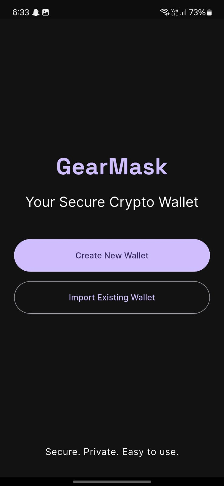
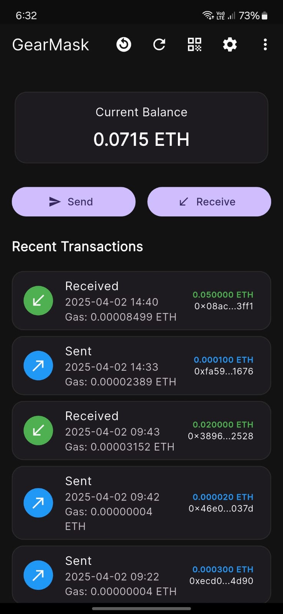
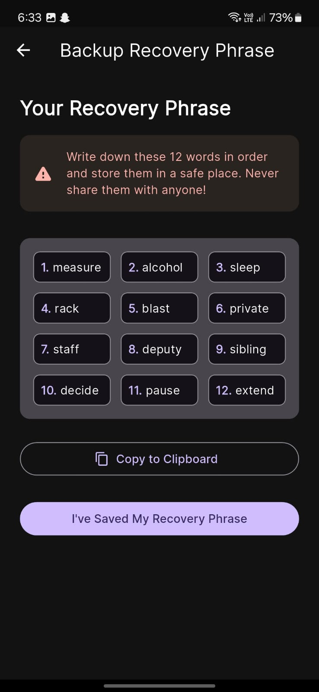
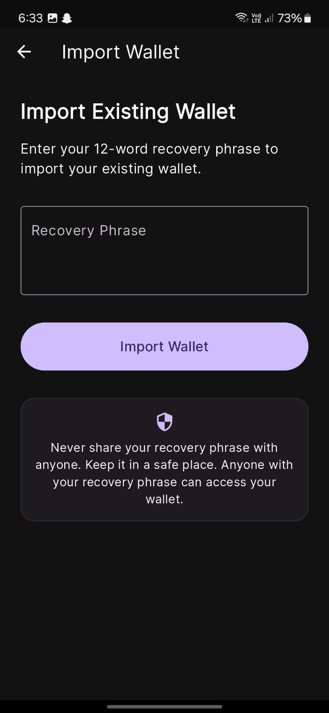
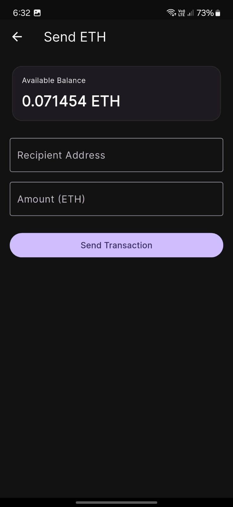
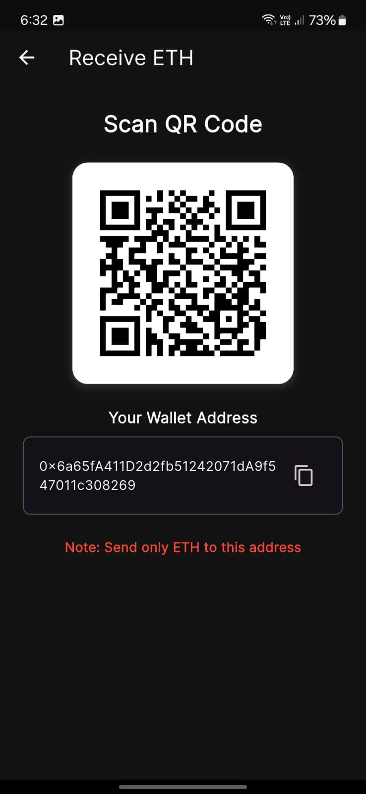
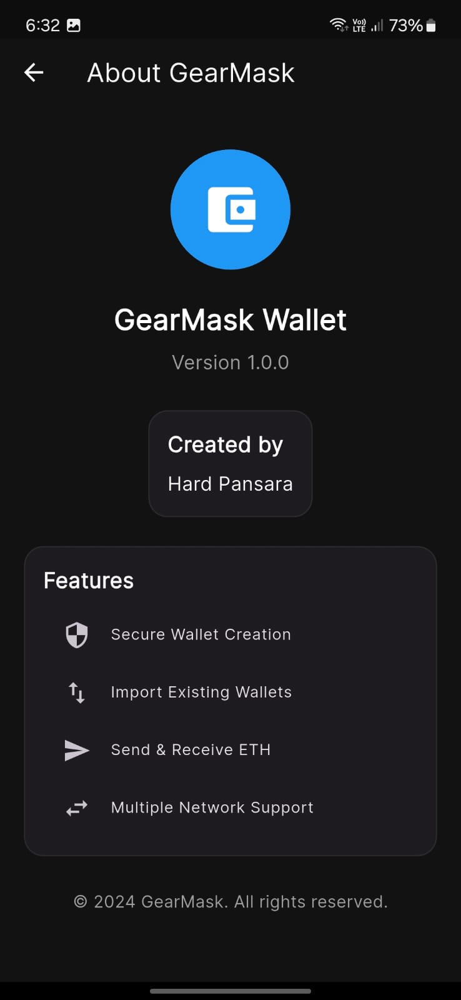

# GearMask Wallet

GearMask is a secure and user-friendly Ethereum wallet application built with Flutter. It provides a modern interface for managing your Ethereum assets with essential features for both beginners and experienced users.

## Features

- 🔒 **Secure Wallet Creation**: Create a new wallet with a 12-word recovery phrase
- 📥 **Wallet Import**: Import existing wallets using recovery phrases
- 💸 **Send & Receive ETH**: Easy-to-use interface for sending and receiving Ethereum
- 🌐 **Multiple Network Support**: Connect to different Ethereum networks (Mainnet, Goerli, Sepolia)
- 🔄 **Live Balance Updates**: Real-time balance tracking
- 📱 **Modern UI/UX**: Clean and intuitive interface with dark mode support
- 🔐 **Secure Storage**: Encrypted storage for sensitive wallet data
- 📊 **Transaction History**: View your recent transactions
- 📷 **QR Code Support**: Easy address sharing via QR codes

## Screenshots

Here are some screenshots of GearMask in action:
## Screenshots

<div align="center">









</div>


## Getting Started

### Prerequisites

- Flutter SDK (version 3.0.0 or higher)
- Dart SDK (version 3.0.0 or higher)
- Android Studio / VS Code with Flutter extensions

### Installation

1. Clone the repository:
```bash
git clone https://github.com/yourusername/gearmask.git
cd gearmask
```

2. Configuration

Before running the app, configure all required API endpoints in: 
```bash 
lib/config/app_config.dart
```
3. Install dependencies:
```bash
flutter pub get
```

4. Run the app:
```bash
flutter run
```

### Building for Production

To create a release build:

```bash
# For Android
flutter build apk --release

# For iOS
flutter build ios --release

# For Web
flutter build web --release
```

## Security Features

- Secure mnemonic generation using BIP39
- Encrypted storage of private keys
- PIN/Password protection for wallet access
- No external storage of private keys
- Client-side only operations

## Network Support

- Ethereum Mainnet
- Goerli Testnet
- Sepolia Testnet

## Dependencies

- `web3dart`: Ethereum implementation
- `bip39`: Mnemonic phrase generation
- `flutter_secure_storage`: Secure key storage
- `provider`: State management
- `qr_flutter`: QR code generation
- Additional dependencies can be found in `pubspec.yaml`

## Architecture

The app follows a clean architecture pattern with:

- `lib/screens`: UI screens
- `lib/providers`: State management
- `lib/services`: Business logic
- `lib/models`: Data models
- `lib/config`: Configuration files
- `lib/widgets`: Reusable widgets

## Contributing

1. Fork the repository
2. Create your feature branch (`git checkout -b feature/AmazingFeature`)
3. Commit your changes (`git commit -m 'Add some AmazingFeature'`)
4. Push to the branch (`git push origin feature/AmazingFeature`)
5. Open a Pull Request

## License

This project is licensed under the MIT License - see the [LICENSE](LICENSE) file for details.

## Creator

Developed by Hard Pansara

## Support

For support, please open an issue in the GitHub repository or contact the development team.

## Disclaimer

This wallet is provided as-is without any guarantees. Users are responsible for securing their private keys and recovery phrases. Always backup your recovery phrase in a secure location.


---

Made with ❤️ by Hard Pansara
